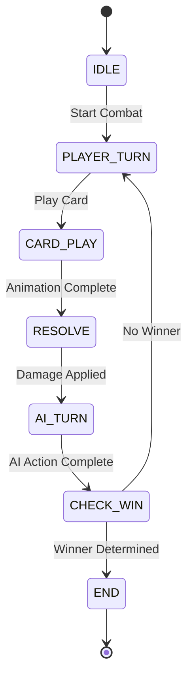

# Design Document: Core Game Loop

## Overview

The Core Game Loop is a high-performance browser-based card game system built with React, TypeScript, Zustand, XState, GSAP, and Framer Motion. The architecture separates the 60fps game loop (RAF-based) from React's render cycle, uses Zustand for reactive state management, XState for combat state machines, and GPU-accelerated animations. The system is designed for code splitting, lazy loading, and strict performance budgets (16.67ms per frame, 90+ Lighthouse score).

## Architecture

### High-Level Architecture

```
┌─────────────────────────────────────────────────────────────┐
│                     React Application                        │
│  ┌──────────────┐  ┌──────────────┐  ┌──────────────┐      │
│  │ Main Menu    │  │   Combat     │  │ Victory/     │      │
│  │ Scene        │  │   Scene      │  │ Defeat Scene │      │
│  └──────────────┘  └──────────────┘  └──────────────┘      │
└─────────────────────────────────────────────────────────────┘
                            │
                            ▼
┌─────────────────────────────────────────────────────────────┐
│                    Zustand State Store                       │
│  ┌──────────────┐  ┌──────────────┐  ┌──────────────┐      │
│  │ Game State   │  │  Card State  │  │  UI State    │      │
│  └──────────────┘  └──────────────┘  └──────────────┘      │
└─────────────────────────────────────────────────────────────┘
                            │
                            ▼
┌─────────────────────────────────────────────────────────────┐
│                      Game Loop (RAF)                         │
│  ┌──────────────┐  ┌──────────────┐  ┌──────────────┐      │
│  │ Tick System  │  │ Delta Time   │  │ Performance  │      │
│  │              │  │ Calculator   │  │ Monitor      │      │
│  └──────────────┘  └──────────────┘  └──────────────┘      │
└─────────────────────────────────────────────────────────────┘
                            │
        ┌───────────────────┼───────────────────┐
        ▼                   ▼                   ▼
┌──────────────┐  ┌──────────────┐  ┌──────────────┐
│ Combat State │  │  Animation   │  │    Audio     │
│  Machine     │  │   System     │  │   System     │
│  (XState)    │  │ (GSAP/FM)    │  │              │
└──────────────┘  └──────────────┘  └──────────────┘
        │                   │                   │
        └───────────────────┼───────────────────┘
                            ▼
                  ┌──────────────────┐
                  │  Input System    │
                  │ (Mouse/KB/Touch) │
                  └──────────────────┘
```

### Component Separation

1. **Game Loop Layer**: Pure JavaScript, no React dependencies, runs at 60fps
2. **State Layer**: Zustand store, bridges game loop and React
3. **View Layer**: React components, subscribes to Zustand, renders UI
4. **Animation Layer**: GSAP timelines, independent of React lifecycle
5. **State Machine Layer**: XState machines, manages combat flow

## Components and Interfaces

### 1. Game Loop System

**Core Interface:**
```typescript
interface GameLoop {
  start(): void
  stop(): void
  pause(): void
  resume(): void
  isPaused(): boolean
  getFPS(): number
  getFrameTime(): number
}

interface GameLoopConfig {
  targetFPS: number
  performanceWarningThreshold: number
  onTick: (deltaTime: number) => void
  onPerformanceWarning: (frameTime: number) => void
}
```

**Implementation Strategy:**
- Use `requestAnimationFrame` for tick scheduling
- Calculate delta time: `(currentTime - lastTime) / 1000`
- Track FPS using rolling average over last 60 frames
- Emit performance warnings when frame time exceeds 16.67ms
- Integrate with Zustand by calling store actions in `onTick`

**Performance Considerations:**
- Avoid allocations in hot path (pre-allocate arrays)
- Use object pooling for frequently created objects
- Batch state updates to minimize React re-renders

### 2. Combat State Machine

**State Diagram:**


**XState Machine Definition:**
```typescript
interface CombatContext {
  playerHP: number
  opponentHP: number
  currentTurn: 'player' | 'opponent'
  selectedCard: Card | null
  playerHand: Card[]
  opponentHand: Card[]
  battlefield: BattlefieldState
}

type CombatEvent =
  | { type: 'START_COMBAT' }
  | { type: 'PLAY_CARD'; card: Card }
  | { type: 'ANIMATION_COMPLETE' }
  | { type: 'DAMAGE_APPLIED' }
  | { type: 'AI_ACTION_COMPLETE' }
  | { type: 'CHECK_COMPLETE'; winner: 'player' | 'opponent' | 'draw' | null }

const combatMachine = createMachine<CombatContext, CombatEvent>({
  id: 'combat',
  initial: 'IDLE',
  states: {
    IDLE: {
      on: { START_COMBAT: 'PLAYER_TURN' }
    },
    PLAYER_TURN: {
      on: { PLAY_CARD: 'CARD_PLAY' }
    },
    CARD_PLAY: {
      on: { ANIMATION_COMPLETE: 'RESOLVE' }
    },
    RESOLVE: {
      on: { DAMAGE_APPLIED: 'AI_TURN' }
    },
    AI_TURN: {
      on: { AI_ACTION_COMPLETE: 'CHECK_WIN' }
    },
    CHECK_WIN: {
      on: {
        CHECK_COMPLETE: [
          { target: 'END', cond: 'hasWinner' },
          { target: 'PLAYER_TURN' }
        ]
      }
    },
    END: {
      type: 'final'
    }
  }
})
```

**State Persistence:**
- Serialize machine state to sessionStorage on scene transition
- Restore state when returning to combat scene
- Clear state on game end

### 3. Card Hand System

**Data Structures:**
```typescript
interface Card {
  id: string
  name: string
  type: 'attack' | 'defense' | 'special'
  rarity: 'common' | 'rare' | 'epic' | 'legendary'
  stats: {
    attack: number
    defense: number
    speed: number
  }
  artwork: string
}

interface CardHandState {
  cards: Card[]
  selectedIndex: number | null
  isDragging: boolean
  dragPosition: { x: number; y: number } | null
}
```

**Hand Management Logic:**
```typescript
function drawCard(deck: Card[], hand: Card[]): Card[] {
  if (deck.length === 0) return hand
  if (hand.length >= 5) return hand
  
  const [drawnCard, ...remainingDeck] = deck
  return [...hand, drawnCard]
}

function playCard(hand: Card[], cardIndex: number): Card[] {
  return hand.filter((_, index) => index !== cardIndex)
}

function selectCard(hand: CardHandState, index: number): CardHandState {
  return {
    ...hand,
    selectedIndex: hand.selectedIndex === index ? null : index
  }
}
```

**Visual Feedback:**
- Hover: Scale card to 1.05, add glow filter
- Selection: Add 2px outline, pulse animation
- Drag: Show semi-transparent preview at cursor, dim original card

### 4. Battlefield System

**Battlefield State:**
```typescript
interface BattlefieldState {
  playerSide: {
    activeCard: Card | null
    hp: number
    maxHP: number
  }
  opponentSide: {
    activeCard: Card | null
    hp: number
    maxHP: number
  }
}
```

**Layout:**
```
┌─────────────────────────────────────┐
│         Opponent Side               │
│  ┌──────┐  HP: ████████░░ 80/100   │
│  │ Card │                           │
│  └──────┘                           │
├─────────────────────────────────────┤
│         Player Side                 │
│  HP: ██████████ 100/100             │
│  ┌──────┐                           │
│  │ Card │                           │
│  └──────┘                           │
└─────────────────────────────────────┘
```

**Damage Calculation:**
```typescript
function calculateDamage(attacker: Card, defender: Card): number {
  const baseDamage = attacker.stats.attack
  const defense = defender.stats.defense
  const speedModifier = attacker.stats.speed > defender.stats.speed ? 1.2 : 1.0
  
  return Math.max(1, Math.floor((baseDamage - defense * 0.5) * speedModifier))
}
```

### 5. AI Opponent System

**AI Strategy:**
```typescript
interface AIOpponent {
  selectCard(hand: Card[]): Card
  getPlayDelay(): number
  shouldMakeSuboptimalMove(): boolean
}

class EasyAI implements AIOpponent {
  selectCard(hand: Card[]): Card {
    if (this.shouldMakeSuboptimalMove()) {
      // 30% chance to pick a random card instead of best card
      return hand[Math.floor(Math.random() * hand.length)]
    }
    
    // Pick card with highest attack
    return hand.reduce((best, card) => 
      card.stats.attack > best.stats.attack ? card : best
    )
  }
  
  getPlayDelay(): number {
    // Random delay between 1000-2000ms
    return 1000 + Math.random() * 1000
  }
  
  shouldMakeSuboptimalMove(): boolean {
    return Math.random() < 0.3
  }
}
```

### 6. Card Data System

**Card Schema:**
```typescript
interface CardSchema {
  id: string
  name: string
  type: 'attack' | 'defense' | 'special'
  rarity: 'common' | 'rare' | 'epic' | 'legendary'
  stats: {
    attack: number
    defense: number
    speed: number
  }
  artwork: string
}

interface CardDatabase {
  cards: CardSchema[]
  version: string
}
```

**Starter Cards (10 cards):**
```json
{
  "cards": [
    {
      "id": "card_001",
      "name": "Quick Strike",
      "type": "attack",
      "rarity": "common",
      "stats": { "attack": 5, "defense": 2, "speed": 8 },
      "artwork": "/assets/cards/quick-strike.png"
    },
    {
      "id": "card_002",
      "name": "Shield Wall",
      "type": "defense",
      "rarity": "common",
      "stats": { "attack": 2, "defense": 8, "speed": 3 },
      "artwork": "/assets/cards/shield-wall.png"
    }
  ]
}
```

**Deck Generation:**
```typescript
function createDeck(cardDatabase: CardDatabase, deckSize: number): Card[] {
  const availableCards = cardDatabase.cards
  const deck: Card[] = []
  
  for (let i = 0; i < deckSize; i++) {
    const randomCard = availableCards[Math.floor(Math.random() * availableCards.length)]
    deck.push({ ...randomCard })
  }
  
  return shuffleDeck(deck)
}

function shuffleDeck(deck: Card[]): Card[] {
  const shuffled = [...deck]
  for (let i = shuffled.length - 1; i > 0; i--) {
    const j = Math.floor(Math.random() * (i + 1))
    ;[shuffled[i], shuffled[j]] = [shuffled[j], shuffled[i]]
  }
  return shuffled
}
```

### 7. Animation System

**GSAP Timeline Architecture:**
```typescript
interface AnimationTimeline {
  cardDraw(card: HTMLElement): gsap.core.Timeline
  cardPlay(card: HTMLElement, target: { x: number; y: number }): gsap.core.Timeline
  cardAttack(card: HTMLElement): gsap.core.Timeline
  damageNumber(element: HTMLElement, damage: number): gsap.core.Timeline
  screenShake(intensity: number): gsap.core.Timeline
  victory(): gsap.core.Timeline
  defeat(): gsap.core.Timeline
}
```

**Example Implementations:**
```typescript
function cardDraw(card: HTMLElement): gsap.core.Timeline {
  return gsap.timeline()
    .from(card, {
      x: -200,
      opacity: 0,
      duration: 0.4,
      ease: 'back.out(1.7)'
    })
}

function cardPlay(card: HTMLElement, target: { x: number; y: number }): gsap.core.Timeline {
  return gsap.timeline()
    .to(card, {
      x: target.x,
      y: target.y - 50, // Arc motion
      duration: 0.3,
      ease: 'power2.out'
    })
    .to(card, {
      y: target.y,
      duration: 0.2,
      ease: 'power2.in'
    })
}

function cardAttack(card: HTMLElement): gsap.core.Timeline {
  const originalX = gsap.getProperty(card, 'x')
  
  return gsap.timeline()
    .to(card, {
      x: `+=${100}`,
      duration: 0.15,
      ease: 'power2.out'
    })
    .to(card, {
      x: originalX,
      duration: 0.15,
      ease: 'power2.in'
    })
}

function screenShake(intensity: number): gsap.core.Timeline {
  const container = document.getElementById('game-container')
  
  return gsap.timeline()
    .to(container, {
      x: intensity,
      duration: 0.05,
      repeat: 3,
      yoyo: true,
      ease: 'none'
    })
    .to(container, {
      x: 0,
      duration: 0.05
    })
}
```

**Performance Optimization:**
- Use `will-change: transform` on animated elements
- Only animate `transform` and `opacity` (GPU-accelerated)
- Kill timelines on component unmount
- Use `gsap.set()` for instant property changes

### 8. Audio System

**Audio Manager:**
```typescript
interface AudioManager {
  playSound(soundId: string, volume?: number): void
  playMusic(musicId: string, loop?: boolean): void
  stopMusic(): void
  setVolume(volume: number): void
  mute(): void
  unmute(): void
}

class WebAudioManager implements AudioManager {
  private context: AudioContext
  private sounds: Map<string, AudioBuffer>
  private musicSource: AudioBufferSourceNode | null
  private volume: number = 1.0
  private isMuted: boolean = false
  
  async loadSound(soundId: string, url: string): Promise<void> {
    const response = await fetch(url)
    const arrayBuffer = await response.arrayBuffer()
    const audioBuffer = await this.context.decodeAudioData(arrayBuffer)
    this.sounds.set(soundId, audioBuffer)
  }
  
  playSound(soundId: string, volume: number = 1.0): void {
    if (this.isMuted) return
    
    const buffer = this.sounds.get(soundId)
    if (!buffer) return
    
    const source = this.context.createBufferSource()
    const gainNode = this.context.createGain()
    
    source.buffer = buffer
    gainNode.gain.value = volume * this.volume
    
    source.connect(gainNode)
    gainNode.connect(this.context.destination)
    source.start(0)
  }
}
```

**Sound Manifest:**
```typescript
const SOUND_MANIFEST = {
  cardDraw: '/assets/audio/card-draw.mp3',
  cardPlay: '/assets/audio/card-play.mp3',
  attackHit: '/assets/audio/attack-hit.mp3',
  damageTaken: '/assets/audio/damage-taken.mp3',
  victoryMusic: '/assets/audio/victory.mp3',
  defeatMusic: '/assets/audio/defeat.mp3',
  combatMusic: '/assets/audio/combat-loop.mp3'
}
```

### 9. Input System

**Unified Input Handler:**
```typescript
interface InputHandler {
  onCardSelect(callback: (index: number) => void): void
  onCardPlay(callback: (index: number) => void): void
  onPause(callback: () => void): void
  onNavigate(callback: (direction: 'left' | 'right') => void): void
  dispose(): void
}

class UnifiedInputHandler implements InputHandler {
  private listeners: Map<string, EventListener[]> = new Map()
  
  constructor() {
    this.setupMouseInput()
    this.setupKeyboardInput()
    this.setupTouchInput()
    this.setupGamepadInput()
  }
  
  private setupMouseInput(): void {
    const handleClick = (e: MouseEvent) => {
      const target = e.target as HTMLElement
      if (target.dataset.cardIndex) {
        const index = parseInt(target.dataset.cardIndex)
        this.emit('cardSelect', index)
      }
    }
    
    document.addEventListener('click', handleClick)
    this.listeners.set('click', [handleClick])
  }
  
  private setupKeyboardInput(): void {
    const handleKeyDown = (e: KeyboardEvent) => {
      switch (e.key) {
        case 'ArrowLeft':
          this.emit('navigate', 'left')
          break
        case 'ArrowRight':
          this.emit('navigate', 'right')
          break
        case 'Enter':
          this.emit('cardPlay', this.selectedIndex)
          break
        case 'Escape':
          this.emit('pause')
          break
      }
    }
    
    document.addEventListener('keydown', handleKeyDown)
    this.listeners.set('keydown', [handleKeyDown])
  }
  
  dispose(): void {
    this.listeners.forEach((listeners, event) => {
      listeners.forEach(listener => {
        document.removeEventListener(event, listener)
      })
    })
    this.listeners.clear()
  }
}
```

**Input Latency Optimization:**
- Use passive event listeners where possible
- Debounce rapid inputs (prevent double-clicks)
- Prioritize input handling in game loop
- Use `requestIdleCallback` for non-critical input processing

### 10. Scene Management

**Scene Interface:**
```typescript
interface Scene {
  name: string
  load(): Promise<void>
  enter(): void
  exit(): void
  update(deltaTime: number): void
  cleanup(): void
}

interface SceneManager {
  registerScene(scene: Scene): void
  transitionTo(sceneName: string, transition?: TransitionType): Promise<void>
  getCurrentScene(): Scene | null
}
```

**Scene Implementations:**
```typescript
class MainMenuScene implements Scene {
  name = 'mainMenu'
  
  async load(): Promise<void> {
    // Lazy load menu assets
    await import('./components/MainMenu')
  }
  
  enter(): void {
    // Mount React component
    // Start menu music
  }
  
  exit(): void {
    // Unmount React component
    // Stop menu music
  }
  
  update(deltaTime: number): void {
    // No game loop updates needed for menu
  }
  
  cleanup(): void {
    // Release resources
  }
}

class CombatScene implements Scene {
  name = 'combat'
  private combatMachine: any
  
  async load(): Promise<void> {
    // Lazy load combat assets
    await Promise.all([
      import('./components/Combat'),
      import('./systems/CombatStateMachine'),
      this.loadCardAssets()
    ])
  }
  
  enter(): void {
    // Initialize combat state machine
    this.combatMachine = createCombatMachine()
    // Start combat music
    // Start game loop
  }
  
  exit(): void {
    // Pause game loop
    // Stop combat music
  }
  
  update(deltaTime: number): void {
    // Update combat state machine
    // Update animations
  }
  
  cleanup(): void {
    // Stop state machine
    // Clear timelines
    // Release card assets
  }
}
```

**Transition System:**
```typescript
type TransitionType = 'fade' | 'wipe' | 'none'

async function transitionTo(
  from: Scene,
  to: Scene,
  type: TransitionType
): Promise<void> {
  // Exit current scene
  from.exit()
  
  // Play transition animation
  if (type === 'fade') {
    await gsap.to('#scene-container', {
      opacity: 0,
      duration: 0.3
    })
  }
  
  // Cleanup old scene
  from.cleanup()
  
  // Load new scene
  await to.load()
  
  // Enter new scene
  to.enter()
  
  // Play transition animation
  if (type === 'fade') {
    await gsap.to('#scene-container', {
      opacity: 1,
      duration: 0.3
    })
  }
}
```

## Data Models

### Zustand Store Structure

```typescript
interface GameStore {
  // Game Loop State
  gameLoop: {
    isRunning: boolean
    isPaused: boolean
    fps: number
    frameTime: number
  }
  
  // Combat State
  combat: {
    state: string // XState machine state
    playerHP: number
    opponentHP: number
    currentTurn: 'player' | 'opponent'
  }
  
  // Card State
  cards: {
    playerHand: Card[]
    opponentHand: Card[]
    playerDeck: Card[]
    opponentDeck: Card[]
    selectedCardIndex: number | null
  }
  
  // Battlefield State
  battlefield: BattlefieldState
  
  // UI State
  ui: {
    currentScene: string
    isTransitioning: boolean
    showPauseMenu: boolean
  }
  
  // Actions
  actions: {
    startGameLoop: () => void
    stopGameLoop: () => void
    pauseGameLoop: () => void
    resumeGameLoop: () => void
    playCard: (cardIndex: number) => void
    drawCard: () => void
    transitionScene: (sceneName: string) => Promise<void>
  }
}
```

### Card Database Schema

```json
{
  "$schema": "http://json-schema.org/draft-07/schema#",
  "type": "object",
  "properties": {
    "version": { "type": "string" },
    "cards": {
      "type": "array",
      "items": {
        "type": "object",
        "properties": {
          "id": { "type": "string" },
          "name": { "type": "string" },
          "type": { "enum": ["attack", "defense", "special"] },
          "rarity": { "enum": ["common", "rare", "epic", "legendary"] },
          "stats": {
            "type": "object",
            "properties": {
              "attack": { "type": "number", "minimum": 0 },
              "defense": { "type": "number", "minimum": 0 },
              "speed": { "type": "number", "minimum": 0 }
            },
            "required": ["attack", "defense", "speed"]
          },
          "artwork": { "type": "string" }
        },
        "required": ["id", "name", "type", "rarity", "stats", "artwork"]
      }
    }
  },
  "required": ["version", "cards"]
}
```

## Correctness Properties

*A property is a characteristic or behavior that should hold true across all valid executions of a system—essentially, a formal statement about what the system should do. Properties serve as the bridge between human-readable specifications and machine-verifiable correctness guarantees.*


### Property Reflection

After analyzing all acceptance criteria, I've identified the following consolidations:

**Redundancies Eliminated:**
- Properties 2.2-2.7 (individual state transitions) can be consolidated into a single comprehensive state machine transition property
- Property 12.2 is identical to 10.5 (input latency) - will use single property
- Audio playback properties 9.1-9.7 can be consolidated into a single property about correct sound triggering

**Properties Combined:**
- Card hand size invariant (3.1) and hand refill behavior (3.7) can be tested together as a single hand management property
- State machine persistence (2.8) is a round-trip property that covers serialization
- Card schema validation (6.3, 6.6) can be combined into a single validation property

**Unique Properties Retained:**
- Delta time calculation (1.2)
- Pause/resume behavior (1.3, 1.4) - idempotence and round-trip
- Performance monitoring (1.5)
- Card selection (3.3)
- Card play removes from hand (3.6)
- AI card selection validity (5.1)
- AI timing (5.3)
- Deck generation (6.5)
- Win/loss/draw conditions (7.1-7.3)
- Animation performance (8.9)
- Input latency (10.5)
- Input conflict prevention (10.6)
- Scene cleanup (11.3)
- Scene transition timing (11.5)
- Frame rate maintenance (12.1)
- Memory stability (12.5)

### Correctness Properties

Property 1: Delta time is always positive and reasonable
*For any* two consecutive frames in the game loop, the calculated delta time should be greater than 0 and less than 1 second (to handle edge cases like tab switching)
**Validates: Requirements 1.2**

Property 2: Pause-resume is idempotent
*For any* game loop state, pausing multiple times should have the same effect as pausing once, and the loop should not execute updates while paused
**Validates: Requirements 1.3**

Property 3: Pause-resume round trip
*For any* running game loop, pausing then resuming should restore the running state and continue frame updates
**Validates: Requirements 1.4**

Property 4: Performance metrics are non-negative
*For any* frame, the FPS and frame time values should be non-negative numbers
**Validates: Requirements 1.5**

Property 5: Combat state machine transitions are valid
*For any* sequence of combat events, the state machine should only transition through valid state paths (IDLE → PLAYER_TURN → CARD_PLAY → RESOLVE → AI_TURN → CHECK_WIN → [PLAYER_TURN | END])
**Validates: Requirements 2.1, 2.2, 2.3, 2.4, 2.5, 2.6, 2.7**

Property 6: Combat state serialization round trip
*For any* valid combat state, serializing then deserializing should produce an equivalent state
**Validates: Requirements 2.8**

Property 7: Card hand size invariant with refill
*For any* card hand state, after playing a card, if the deck is not empty, the hand size should be maintained (card removed, new card drawn)
**Validates: Requirements 3.1, 3.7**

Property 8: Card selection toggles state
*For any* card hand, clicking a card should toggle its selection state (unselected → selected, selected → unselected)
**Validates: Requirements 3.3**

Property 9: Playing a card removes it from hand
*For any* card hand, playing a card at index i should result in a hand that no longer contains that card
**Validates: Requirements 3.6**

Property 10: Battlefield card placement is side-correct
*For any* card played, player cards should be placed on the player side and opponent cards on the opponent side
**Validates: Requirements 4.2**

Property 11: AI selects valid cards
*For any* AI hand state, the card selected by the AI should be a member of the AI's current hand
**Validates: Requirements 5.1**

Property 12: AI selection is eventually uniform
*For any* AI hand with multiple cards, over many selections, all cards should be selected at least once (tests randomness)
**Validates: Requirements 5.2**

Property 13: AI play delay is within bounds
*For any* AI card selection, the delay before playing should be between 1000ms and 2000ms
**Validates: Requirements 5.3**

Property 14: Card data serialization round trip
*For any* valid card, serializing to JSON then deserializing should produce an equivalent card
**Validates: Requirements 6.1**

Property 15: Card schema validation
*For any* card loaded from the database, it should have all required fields (id, name, type, rarity, stats with attack/defense/speed, artwork)
**Validates: Requirements 6.3, 6.6**

Property 16: Deck generation produces valid deck
*For any* deck generated from the card database, the deck should have exactly 20 cards and all cards should be from the available card pool
**Validates: Requirements 6.5**

Property 17: Win condition triggers on opponent HP zero
*For any* combat state where opponent HP reaches 0, the combat state machine should transition to END with a win result
**Validates: Requirements 7.2**

Property 18: Loss condition triggers on player HP zero
*For any* combat state where player HP reaches 0, the combat state machine should transition to END with a loss result
**Validates: Requirements 7.1**

Property 19: Draw condition triggers on simultaneous zero HP
*For any* combat state where both player and opponent HP reach 0 simultaneously, the combat state machine should transition to END with a draw result
**Validates: Requirements 7.3**

Property 20: Audio events trigger correct sounds
*For any* game event (card draw, card play, attack, damage, victory, defeat), the audio system should trigger the corresponding sound effect or music
**Validates: Requirements 9.1, 9.2, 9.3, 9.4, 9.5, 9.6, 9.7**

Property 21: Audio volume control affects playback
*For any* volume level between 0 and 1, setting the volume should affect the playback level, and muting should silence all audio
**Validates: Requirements 9.8**

Property 22: Input latency is within threshold
*For any* input event, the time between input and system response should be less than 100ms
**Validates: Requirements 10.5, 12.2**

Property 23: Input conflicts are prevented
*For any* simultaneous inputs from multiple devices, only one input should be processed per frame
**Validates: Requirements 10.6**

Property 24: Scene cleanup releases resources
*For any* scene exit, all event listeners, timelines, and allocated resources should be released
**Validates: Requirements 11.3**

Property 25: Scene transitions complete within threshold
*For any* scene transition, the transition should complete within 500ms
**Validates: Requirements 11.5**

Property 26: Frame rate maintains 60fps
*For any* 60-frame window during combat, the average FPS should be at least 60 (allowing for minor variance)
**Validates: Requirements 12.1**

Property 27: Combat scene loads within threshold
*For any* combat scene load, the loading time should be less than 3 seconds
**Validates: Requirements 12.4**

Property 28: Memory usage is stable over multiple battles
*For any* sequence of 10 consecutive battles, the memory usage after the 10th battle should not exceed 150% of the memory usage after the 1st battle
**Validates: Requirements 12.5**

## Error Handling

### Game Loop Errors

**Frame Time Spike:**
- Detect: Frame time > 16.67ms
- Handle: Log warning, continue execution
- Recovery: Skip physics updates if delta time > 100ms (tab switch scenario)

**RAF Not Available:**
- Detect: `requestAnimationFrame` is undefined
- Handle: Fallback to `setTimeout` with 16ms interval
- Recovery: Display warning to user about degraded performance

### State Machine Errors

**Invalid State Transition:**
- Detect: Transition not defined in machine
- Handle: Log error, stay in current state
- Recovery: Reset to IDLE state if stuck

**State Persistence Failure:**
- Detect: sessionStorage unavailable or quota exceeded
- Handle: Continue without persistence
- Recovery: Start fresh combat on scene transition

### Card System Errors

**Empty Deck:**
- Detect: Deck length === 0 when trying to draw
- Handle: Don't draw card, continue with current hand
- Recovery: Normal gameplay continues with smaller hand

**Invalid Card Data:**
- Detect: Card missing required fields during load
- Handle: Skip invalid card, log error
- Recovery: Continue with valid cards only

**Hand Overflow:**
- Detect: Hand size > 5
- Handle: Discard oldest card
- Recovery: Maintain hand size at 5

### Animation Errors

**GSAP Timeline Failure:**
- Detect: Timeline creation throws error
- Handle: Skip animation, proceed with state change
- Recovery: Continue gameplay without animation

**WebGL Context Loss:**
- Detect: `webglcontextlost` event
- Handle: Fallback to 2D canvas rendering
- Recovery: Attempt to restore WebGL context

### Audio Errors

**Audio Context Suspended:**
- Detect: AudioContext.state === 'suspended'
- Handle: Resume context on user interaction
- Recovery: Play queued sounds after resume

**Sound Load Failure:**
- Detect: Fetch or decode error
- Handle: Continue without that sound
- Recovery: Retry load on next game start

### Input Errors

**Event Listener Failure:**
- Detect: addEventListener throws error
- Handle: Log error, continue with other input methods
- Recovery: Retry listener setup on next scene

**Input Flood:**
- Detect: > 100 events per second
- Handle: Throttle input processing
- Recovery: Process only most recent event per frame

### Scene Management Errors

**Scene Load Failure:**
- Detect: Dynamic import fails
- Handle: Display error screen with retry option
- Recovery: Retry load or return to main menu

**Memory Leak Detection:**
- Detect: Memory usage grows > 200MB
- Handle: Force garbage collection, log warning
- Recovery: Prompt user to restart game

## Testing Strategy

### Dual Testing Approach

This feature requires both unit tests and property-based tests for comprehensive coverage:

**Unit Tests** focus on:
- Specific examples of state transitions
- Edge cases (empty deck, zero HP, simultaneous events)
- Error conditions (invalid input, missing data)
- Integration points between systems

**Property-Based Tests** focus on:
- Universal properties across all inputs
- State machine transition validity
- Data structure invariants
- Performance characteristics

Both approaches are complementary and necessary. Unit tests catch concrete bugs in specific scenarios, while property tests verify general correctness across the input space.

### Property-Based Testing Configuration

**Library:** fast-check (TypeScript/JavaScript property-based testing library)

**Configuration:**
- Minimum 100 iterations per property test
- Each test tagged with feature name and property number
- Tag format: `Feature: core-game-loop, Property {N}: {property text}`

**Example Property Test:**
```typescript
import fc from 'fast-check'

// Feature: core-game-loop, Property 7: Card hand size invariant with refill
test('playing a card maintains hand size when deck is not empty', () => {
  fc.assert(
    fc.property(
      fc.array(cardArbitrary(), { minLength: 1, maxLength: 20 }), // deck
      fc.array(cardArbitrary(), { minLength: 3, maxLength: 5 }), // hand
      fc.integer({ min: 0, max: 4 }), // card index to play
      (deck, hand, cardIndex) => {
        const initialHandSize = hand.length
        const newHand = playCard(hand, cardIndex)
        const refilledHand = drawCard(deck, newHand)
        
        expect(refilledHand.length).toBe(initialHandSize)
      }
    ),
    { numRuns: 100 }
  )
})
```

### Unit Testing Strategy

**Test Organization:**
- One test file per system (GameLoop.test.ts, CombatStateMachine.test.ts, etc.)
- Group related tests with describe blocks
- Use beforeEach for common setup

**Key Unit Tests:**

1. **Game Loop:**
   - Start/stop/pause/resume functionality
   - FPS calculation accuracy
   - Performance warning threshold

2. **Combat State Machine:**
   - Each state transition path
   - Win/loss/draw condition detection
   - State persistence and restoration

3. **Card Hand:**
   - Card selection and deselection
   - Card play and hand refill
   - Empty deck edge case

4. **AI Opponent:**
   - Card selection from hand
   - Play delay timing
   - Random selection distribution

5. **Audio System:**
   - Sound playback on events
   - Volume control
   - Mute functionality

6. **Input System:**
   - Mouse, keyboard, touch, gamepad events
   - Input latency measurement
   - Conflict prevention

7. **Scene Management:**
   - Scene transitions
   - Resource cleanup
   - Load timing

### Integration Testing

**Critical Integration Points:**
1. Game Loop → Zustand Store → React Components
2. Combat State Machine → Animation System
3. Input System → Card Hand → Combat State Machine
4. Scene Manager → All Systems (cleanup on transition)

**Integration Test Examples:**
- Complete battle flow (start to win/loss)
- Scene transition with state preservation
- Input event triggering animation and audio

### Performance Testing

**Metrics to Track:**
- FPS during combat (target: 60fps)
- Input latency (target: <100ms)
- Scene load time (target: <3s)
- Memory usage over 10 battles (target: stable)
- Bundle size (target: <200KB initial)

**Performance Test Approach:**
- Use Performance API for timing measurements
- Run tests in CI with performance budgets
- Fail build if metrics exceed thresholds

### Test Coverage Goals

- Line coverage: >80%
- Branch coverage: >75%
- Property test coverage: All identified properties
- Integration test coverage: All critical paths

### Continuous Integration

**CI Pipeline:**
1. Run unit tests
2. Run property-based tests (100 iterations each)
3. Run integration tests
4. Check performance budgets
5. Generate coverage report
6. Fail if any test fails or coverage drops

**Performance Budgets in CI:**
- Bundle size check: <200KB
- Lighthouse CI: Score >90
- Memory leak detection: Heap size stable
